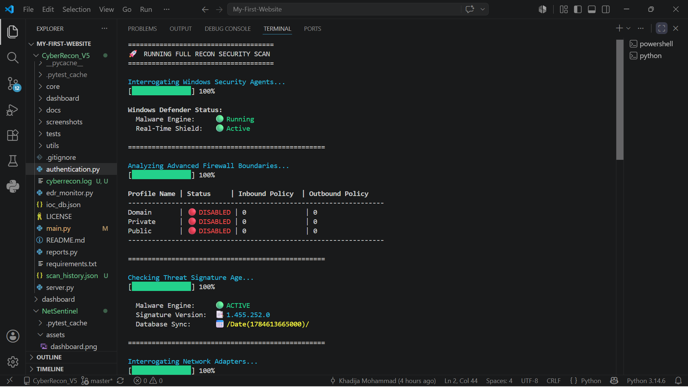

# 🛡️ CyberRecon Enterprise


> **Enterprise Cyber Reconnaissance, EDR Monitoring, and Automated SOAR Framework**

## 💡 Why I Built This

Modern enterprise environments demand continuous visibility and rapid incident response to combat evolving security threats. Many security operations centers (SOCs) struggle with fragmented telemetry across endpoints, network boundaries, and threat intelligence feeds. **CyberRecon Enterprise** was engineered to solve this problem by consolidating endpoint detection and response (EDR), live system diagnostic auditing, and incident correlation into a unified, lightweight framework.

I built this project to deepen my understanding of system-level security architecture, asynchronous event handling, and defensive telemetry. Rather than relying solely on third-party security tools, I wanted to build an end-to-end framework from scratch—implementing custom process monitoring, rule-based threat correlation, and live reporting interfaces to understand the underlying mechanics of modern EDR and SIEM platforms.

This project demonstrates proficiency in **Python systems programming**, **asynchronous API architecture (FastAPI & WebSockets)**, **security automation (SOAR mechanics)**, **object-oriented software design**, and **modular test-driven development**.

CyberRecon Enterprise is a high-performance Python security platform designed for real-time endpoint detection and response (EDR), Security Information and Event Management (SIEM) telemetry analysis, and automated Security Orchestration, Automation, and Response (SOAR) containment.

---



## ✨ Key Features

* **✔ Real-Time Process Monitoring:** Tracks active PIDs, parent-child relationships, and suspicious process executions.
* **✔ Dynamic WebSocket Dashboard:** Live streaming event telemetry pushed straight to a responsive web UI via FastAPI and WebSockets.
* **✔ IOC Detection Engine:** Scans local artifacts and running memory against known Indicators of Compromise (IOCs).
* **✔ MITRE ATT&CK Mapping:** Automatically correlates detected events against standardized MITRE techniques (`T1059.001`, `T1059.003`, `T1547.001`, `T1562.004`).
* **✔ Behavioral Detection & SIEM Correlation:** Sliding-window behavioral rules engine for detecting multi-stage attack chains.
* **✔ Automated SOAR Response Modes:** Configurable policy engine supporting **Passive**, **Interactive**, and **Automatic** process containment.
* **✔ Digital Forensics & Report Generation:** Automated incident log generation and forensic snapshot collection.

---

## 🏗️ Architecture

```text
  [ System Endpoints ] ──► [ Telemetry Collector ] ──► [ Correlation Engine ]
                                                               │
                                         ┌─────────────────────┴─────────────────────┐
                                         ▼                                           ▼
                                 [ WebSocket Server ]                         [ SOAR Policy Engine ]
                                         │                                           │
                                         ▼                                           ▼
                                [ Live Web Dashboard ]                      [ Containment Actions ]