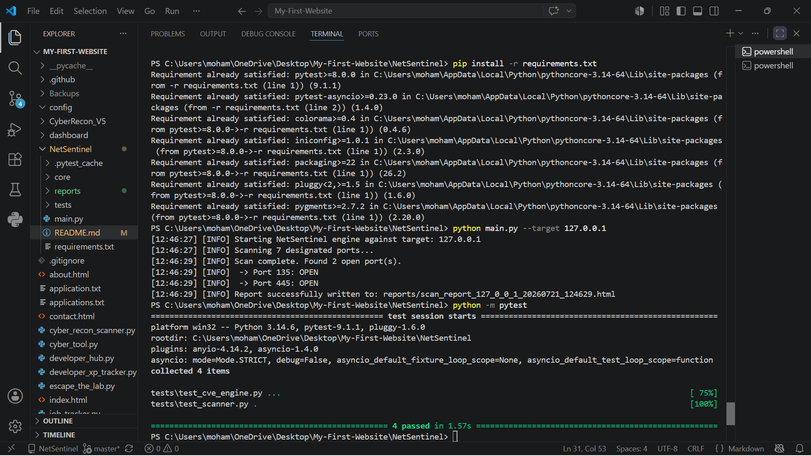
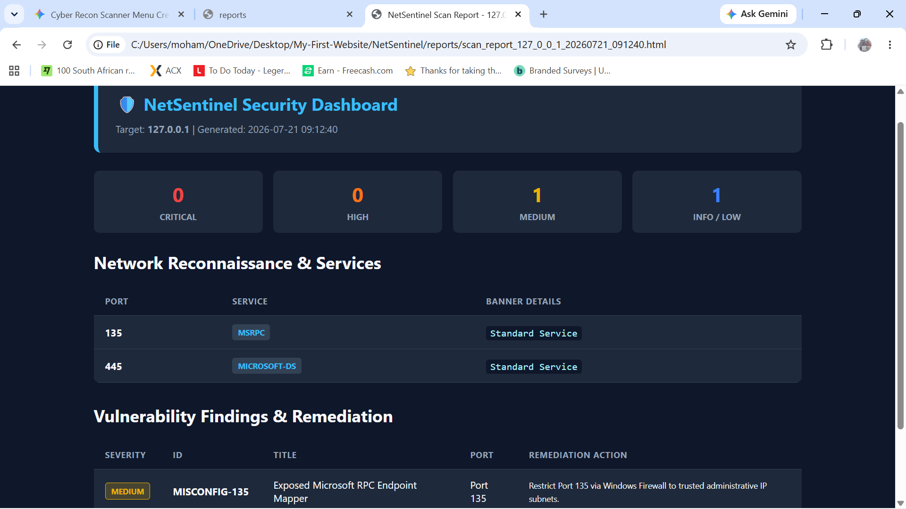

# 🛡️ NetSentinel

[](https://github.com/khadijamohammad/my-portfolio/actions/workflows/test.yml)


**NetSentinel** is an asynchronous Python-based network security utility designed for fast service reconnaissance, banner grabbing, vulnerability correlation, and automated security report generation.

---

## 📸 Demo & Preview

### Terminal Execution


### Generated HTML Security Report

## 🎯 Features

* ⚡ **Asynchronous Scanning:** Fast concurrent port scanning powered by Python's `asyncio`.
* 🔍 **Service Banner Detection:** Extracts banner info on open ports to identify running services.
* 🛡️ **CVE Risk Correlation:** Maps identified service banners against known vulnerability data.
* 📊 **HTML Dashboard Generation:** Generates clean, standalone HTML reports saving directly to disk.
* 🪵 **Structured Logging:** Timestamps and level-based console outputs for clear execution tracking.
* 🧪 **Automated CI/CD:** Covered by unit tests and validated on every commit via GitHub Actions.

---

## 🏗️ Architecture & Data Flow

```mermaid
graph TD
    A[CLI Entrypoint: main.py] --> B[Async Scanner: core/scanner.py]
    B -->|Network Connection| C[Target Network / Host]
    B -->|Banner Raw Data| D[CVE Engine: core/cve_engine.py]
    B -->|Scan Logs| E[Structured Logger: utils/logger.py]
    D -->|Vulnerability Matches| F[Report Generator: reports/generator.py]
    F -->|Render HTML| G[reports/scan_report_*.html]